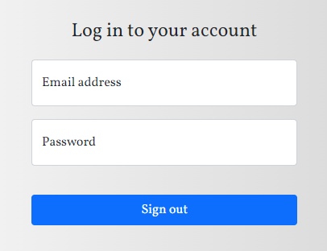

# User registration card.

# *Опис*

Цей проєкт дозволяє створювати акаунти для користувачів. Він містить три картки, а саме “Створити акаунт”, “Увійти якщо зареєстрований” та “Акаунт користувача”.

## Картка “Створити акаунт”

Для того, щоб зареєструватися новому користувачеві, необхідно виконати декілька умов:  

 1. Заповнити всі поля;  

Якщо поле не буде заповнене, програма підсвітить червоним кольором.

 2. Вірно заповнити поле "Email";

 3. Погодитися з правилами обслуговування;

Як тільки все це буде зроблено вірно, кнопка зареєструватися "Sign up" буде активною, при її натисканні акаунт користувача виводиться з його інформацією.

## Картка “Акаунт користувача”

Дана картка містить в собі всю інформацію, яку користувач вводив під час реєстрації.

При натискані кнопки "Go out" користувач виходить зі свого акаунту та повертається до попередньої картки.

## Картка “Увійти якщо зареєстрований”

Якщо користувач вже зареєстрований і хоче увійти у свій акаунт, він може скористатися кнопкою "Sign in".

Для того, щоб користувач увійшов у свій акаунт йому необхідно вірно ввести email та пароль, який він вказував під час реєстрації.

Якщо користувач вказав не вірні дані, йому з'явиться повідомлення “Incorrect password or email”.

Коли користувач вказав вірні дані, йому відкривається обліковий запис з інформацією.

# *Про проєкт*

Для того, щоб зберегти всю введену інформацію користувача, використовується локальне сховище localStorage.

Під час входу в обліковий запис email та пароль перевіряється з наявними email та паролем в localStorage, який користувач вказав при реєстрації.

В даному проєкті для стилізації елементів було використано фреймворк Bootstrap.
 
Вся логіка написана на чистому JavaScript

PS. Даний проект я розробив, для того щоб попрактикуватися, тому не чекайте надто багато від мого вихідного коду =)